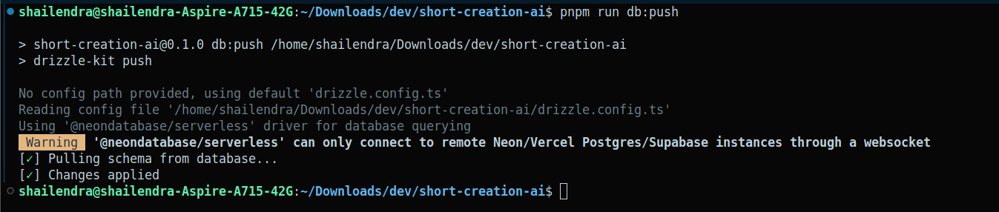
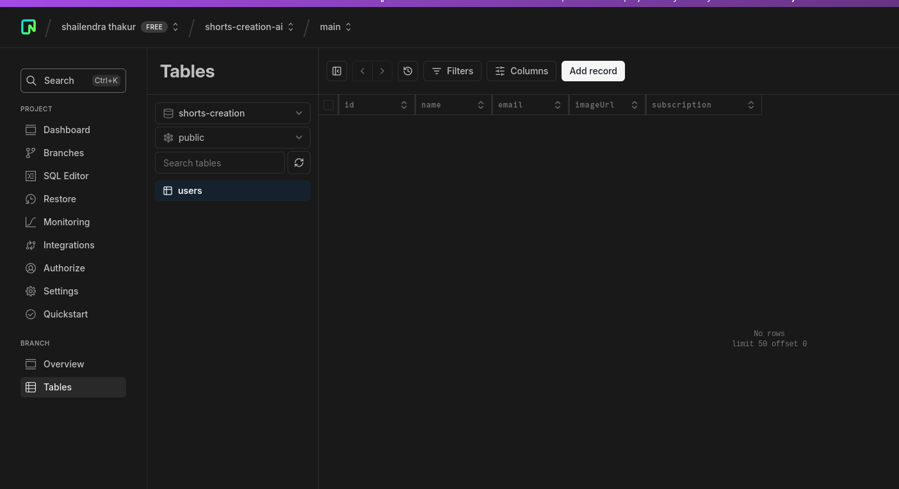

Getting Started with Drizzle ORM
go-to-https://orm.drizzle.team/docs/get-started/neon-new

To setup the drizzle kit
https://orm.drizzle.team/docs/kit-overview

sometime getting error because of the url in the
drizzle.config.ts
after it run pnpm run db:push to check

to check apply check

to tun the studio in the local machine

## To Authenticate with cleark

remember when clerkMiddleware is not protected route
bydefault all the route is public

###

Major changes
1.- console.log not print---
2.- path mismach http://localhost:3000/dashboard/dashboard/upgrade--solve by using = with other ==
